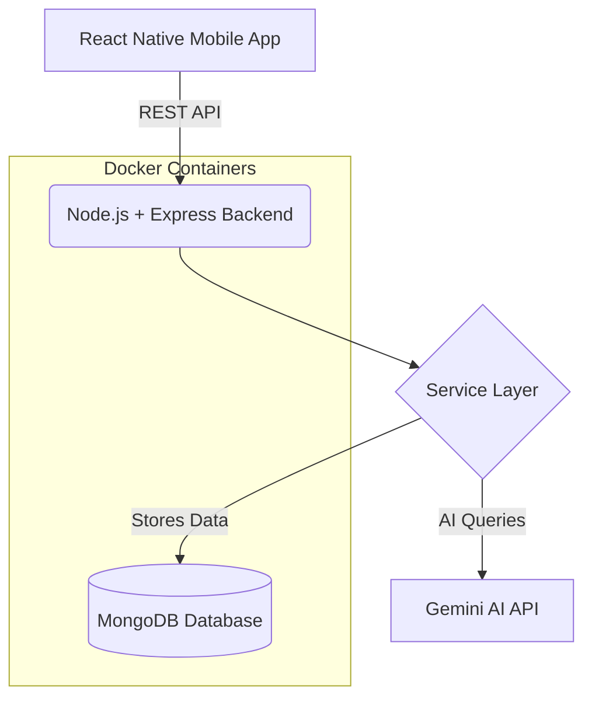

# Smart Reporting System 🚀

> **Problem:** Many campuses and public spaces lack a simple way to report issues or get quick assistance. Problems like broken infrastructure, safety concerns, or emergency situations often go unreported.<br>
> **Impact:** Delays in fixing critical issues, decreased safety, and a lack of clear communication between users and authorities.<br>
> **Solution:** Our solution is an AI-powered smart reporting system that allows users to instantly report issues and receive assistance using a mobile app.

User → Mobile App → Backend → AI Assistant → Database

---

## 🏗️ System Architecture

Our platform follows a modern, modular, and scalable architecture:



**Key Engineering Concepts:**
- **Modular Architecture:** Separation of concerns using controllers, routes, and services.
- **REST APIs:** Standardized communication between client and server.
- **Containerization:** Consistent environments using Docker.
- **AI Integration:** Intelligent chatbot assistance.
- **Scalable Backend:** Stateless architecture ready for load balancing.

---

## 🔄 Real User Flow

1. **User Registration & Login:** Secure access to the mobile app.
2. **Issue Reporting:** Users submit a report with relevant details and photos.
3. **Data Processing:** When the user submits a report, the frontend sends a REST request to our Node.js backend.
4. **Storage & Live Updates:** The backend stores the issue in MongoDB and updates the dashboard in real time. The AI chatbot is available to assist users.
5. **Dashboard Visualization:** Authorities and users can track reports on a clean dashboard containing:
   - 📍 Report Issue
   - 🤖 AI Assistant
   - 👤 Profile
   - 👥 Team

---

## ✨ Technical Features

- **🧠 AI Integration:** We integrated the **Gemini AI API** to provide intelligent assistance and guide users on how to report issues effectively.
- **⚙️ Backend Architecture:** We designed the backend with controllers, routes, services, and models to maintain clean architecture.
- **🐳 Docker Containerization:** We containerized the backend and database using Docker, ensuring consistent environments and scalable deployment.
- **📊 Database Optimization:** We used **MongoDB** with indexed queries for faster data retrieval and flexible schema design.

---

## 📈 Scalability

**Can this scale?** Yes. 
Our system is stateless and containerized, so we can scale horizontally by adding more backend instances behind a load balancer.

Other key scaling factors include:
- **Pagination for reports:** To handle large volumes of data on the frontend and backend.
- **Indexed database queries:** To ensure fast lookups even as the database grows.
- **Microservice-ready architecture:** Clear separation of concerns makes it easy to decompose the monolith in the future.

---

## 🎨 UI/UX Highlights

Creativity and usability are at the core of our solution. Even strong code loses if the UI is messy.

Our mobile app features:
- **Clean & Minimalist Design:** Focused on user goals without clutter.
- **Consistent Visual Language:** Harmonized colors and clear navigation.
- **AI-Powered Assistance:** Unlike traditional reporting systems, our platform combines AI assistance with a mobile interface to simplify issue reporting.

---

## 🚀 Future Vision

We are building this not just as a hackathon prototype, but as a robust platform. In the future, we plan to integrate:
- **Real-Time Notifications:** Push alerts for status updates on priority safety reports.
- **Geolocation Tracking:** Advanced mapping to pinpoint recurring issue hotspots.
- **Predictive Analytics:** Using AI to identify high-risk areas based on historical reporting data.

---

## 💻 Tech Stack

- **Frontend:** React Native (cross-platform mobile development using a single codebase)
- **Backend:** Node.js, Express.js
- **Database:** MongoDB
- **AI Integration:** Google Gemini API
- **DevOps:** Docker

---

## 🛠️ Setup & Installation

### Prerequisites
- Docker & Docker Compose setup
- Node.js (for native execution)
- Expo Go (or React Native development environment)

### Running the Project

1. **Clone the repository:**
   ```bash
   git clone <your-repo-url>
   cd <project-folder>
   ```

2. **Environment Variables:**
   Create a `.env` file in the `backend/` directory:
   ```env
   PORT=5000
   MONGO_URI=your_mongodb_connection_string
   GEMINI_API=your_gemini_api_key
   ```

3. **Start the Backend (Docker):**
   ```bash
   cd backend
   docker-compose up --build
   ```

4. **Start the Frontend:**
   ```bash
   cd hackathon-app
   npm install
   npx expo start
   ```

---

### *“Our project demonstrates how AI, mobile technology, and scalable backend architecture can work together to build a smart reporting platform that improves communication between users and authorities.”*
"# ai-app" 
